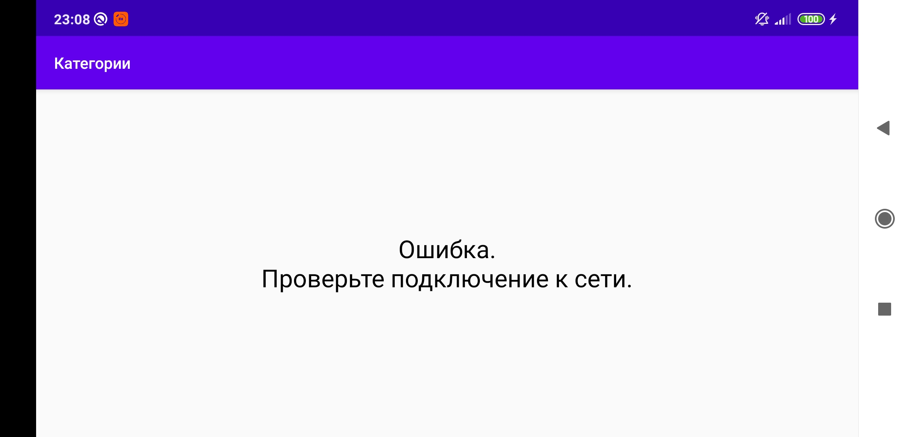
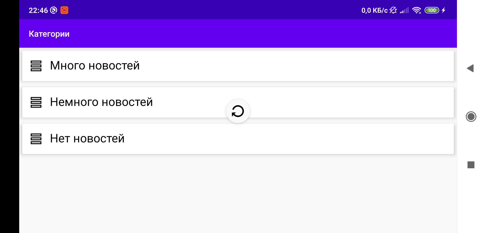
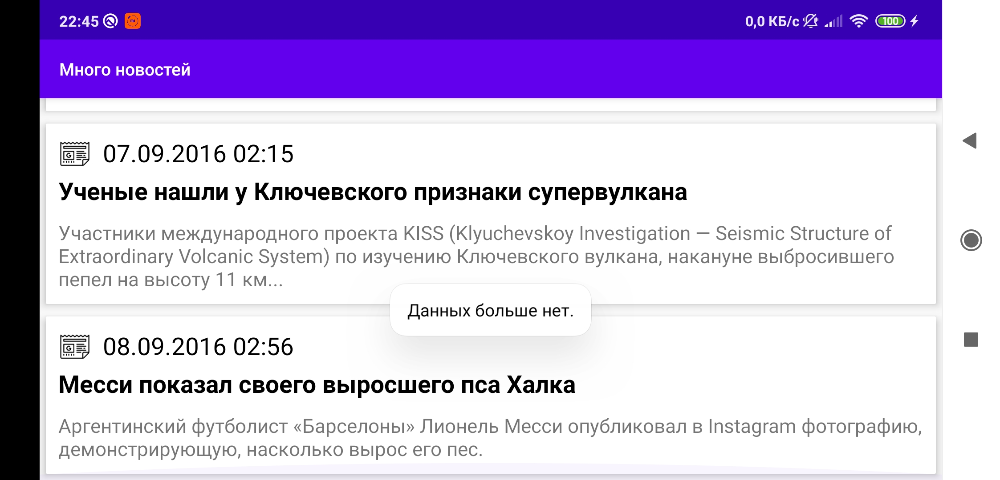

# Test task for Sebbia

- [Operations](#operations)
- [Screenshots](#screenshots)
  - [Portrait](#portrait)
  - [Landscape](#landscape)
- [Entities](#entities)
- [Interface](#interface)
- [Links](#links)

<h2>Operations</h2>
<p><b>GET</b> /v1/news/categories</p>
<p><b>GET</b> /v1/news/categories/{id}/news</p>
<p><b>GET</b> /v1/news/details</p>

<h2>Screenshots</h2>
<p>Screenshots in full resolution.</p>
<h3>Portrait</h3>
<div style="display:flex;">


</div>
<h3>Landscape</h3>
<div>
<p></p>
<p></p>
<p></p>
</div>

<h3>Entities</h3>

```kotlin
class ResultEntity<T> (
    val code : Int,
    val list : List<T>
)

class Category(
    val id : Int,
    val name : String
)

class News (
    val id: Int,
    val date: DateTime,
    val title: String,
    val shortDescription: String,
    val fullDescription: String?
)

class NewsEntity (
    val code : Int,
    val news : News
)
```

<h3>Interface</h3>

```kotlin
interface NewsApi {

    @GET("/v1/news/categories")
    fun requestCategories() : Single<Response<ResultEntity<Category>>>

    @GET("/v1/news/categories/{id}/news")
    fun requestCategory(
        @Path("id") id : Int,
        @Query("page") page : Int
    ) : Single<Response<ResultEntity<News>>>

    @GET("/v1/news/details")
    fun requestNewsDetails(@Query("id") id : Int) : Single<Response<NewsEntity>>

}
```

<h3>Links</h3>
<p><a href='http://testtask.sebbia.com/swagger-ui.html'>Swagger</a></p>
