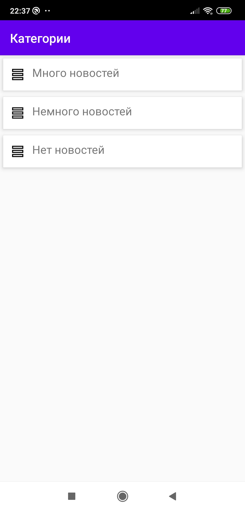
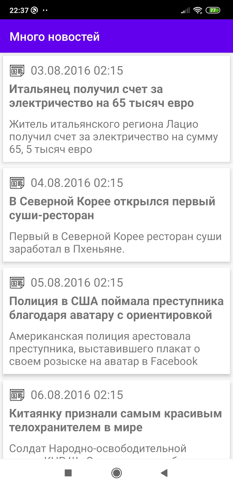
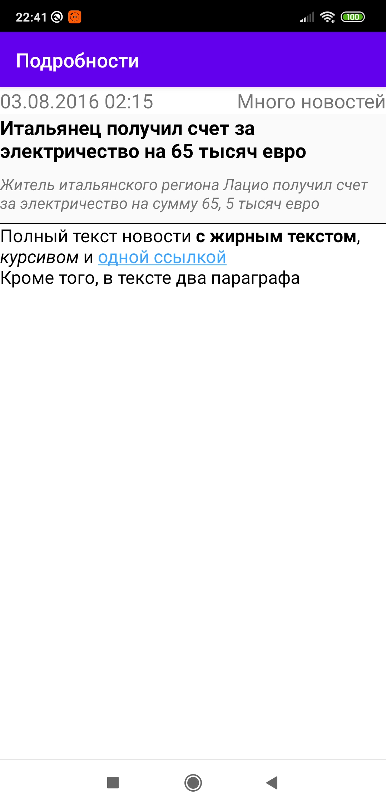

# Test task for Sebbia

Operations:

<b>GET</b> /v1/news/categories

<b>GET</b> /v1/news/categories/{id}/news

<b>GET</b> /v1/news/details

<a href='http://testtask.sebbia.com/swagger-ui.html'>Swagger</a>
