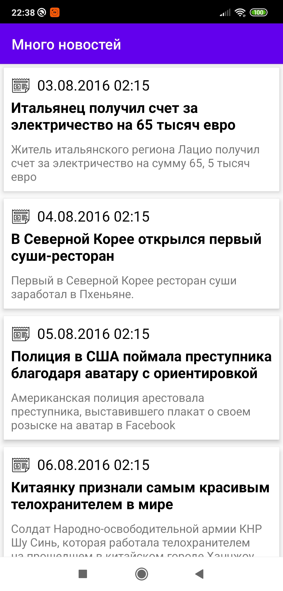

# Test task for Sebbia

Operations:
<p><b>GET</b> /v1/news/categories</p>
<p><b>GET</b> /v1/news/categories/{id}/news</p>
<p><b>GET</b> /v1/news/details</p>

<div style="display:flex;">



</div>

```kotlin
//Entities

class ResultEntity<T> (
    val code : Int,
    val list : List<T>
)

class Category(
    val id : Int,
    val name : String
)

class News (
    val id: Int,
    val date: DateTime,
    val fullDescription: String,
    val shortDescription: String,
    val title: String
)

class NewsEntity (
    val code : Int,
    val news : News
)

```

<a href='http://testtask.sebbia.com/swagger-ui.html'>Swagger</a>
